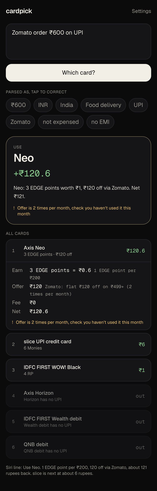

# cardpick

Tell it what you're about to buy, it tells you which card to use. Deterministic rules engine, LLM only parses the input.

Live instance: https://swipe.aayu.sh (single user, needs the shared secret).

<p align="center"></p>

## What it does

You type "Zomato order ₹600 on UPI" or "Claude subscription $200, expensed" or "Uber in Doha, 17 riyals". You get:

- the card to use, with a one-line reason and the net rupee value;
- every card ranked, each expandable into earn, offer, fee and net;
- warnings where they matter: zero-earn MCCs, slab rounding, EMI, forex markup, offer caps;
- a row of "parsed as" chips you can tap to correct. Corrections re-run the engine only, not the parser;
- a Siri-ready sentence via `POST /api/ask`, for an iOS Shortcut.

It does not track offer usage or credit limits. It shows the cap and frequency and you keep count.

## Two layers, strictly separated

**Parser (LLM).** `src/lib/parser.ts` sends your text to `gpt-5.6-luna` through the OpenAI Responses API with a strict JSON schema and low reasoning effort. Its only output is a `TransactionInput`:

```ts
type TransactionInput = {
  amount: number;                 // in the transaction currency
  currency: "INR" | "QAR" | "USD" | "OTHER";
  country: "IN" | "QA" | "OTHER"; // where the merchant is, not where you are
  merchantName?: string;          // used for offer matching
  category: "airline_direct" | "airline_ota" | "hotel" | "dining" | "food_delivery"
    | "grocery_quick_commerce" | "shopping_online" | "shopping_offline"
    | "subscription_software" | "ride_hailing" | "fuel" | "utility" | "insurance"
    | "rent" | "education" | "government" | "wallet_load" | "movies" | "pharmacy" | "other";
  rail: "upi" | "card_online" | "card_pos" | "tap";
  expensed: boolean;              // fees still shown, but scored as zero
  isEmi: boolean;
  notes?: string;
};
```

The parser never sees the card table and never picks a card. Anything it cannot infer comes back as `null` and the UI asks one follow-up question.

**Rules engine (TypeScript).** `src/lib/engine/` takes the `TransactionInput` plus your settings and scores every card in `src/lib/cards.ts`. No network, no LLM. `POST /api/recommend` with a pre-filled input skips the parser entirely. The steps are written up in [docs/scoring.md](docs/scoring.md) and pinned down by `tests/engine.test.ts`.

Every number in a recommendation comes from the card table or a settings value. Nothing is guessed.

## Add your own cards

Edit `src/lib/cards.ts`. That is the one file. Each card declares its earn slabs, zero-earn categories, UPI support, forex markup and whether GST applies to it, currency restrictions, and merchant offers with caps and frequency. Issuer quirks are card properties, so the engine has no branches keyed on a card id. The schema with an annotated example is in [docs/cards.md](docs/cards.md). Category to MCC mapping is in `src/lib/categories.ts`.

Values per point (mile, EDGE point, Monie, RP) are settings, not card data, because they depend on how you redeem.

## Run it

```bash
pnpm install
cp .env.example .env.local   # OPENAI_API_KEY, CARDPICK_SECRET
pnpm dev
pnpm test                    # engine tests, no network
```

Without Redis env vars the app keeps settings in memory and says so on the settings page.

## Deploy

Vercel plus Upstash Redis from the Vercel Marketplace, custom domain through Cloudflare DNS. Env vars, KV setup and domain steps are in [docs/deploy.md](docs/deploy.md).

## iOS Shortcut

Dictate Text, Get Contents of URL, Get Dictionary Value `speech`, Speak Text. The exact request and response contract is in [docs/shortcut.md](docs/shortcut.md).

## Fold history

If `FOLD_TOKEN` is set, a collapsed "What you did before" panel shows up to five past transactions at a similar merchant or category and which account they hit, pulled from Fold's MCP server. It is history, not advice, and never feeds the score. If the token is absent or the call fails, the panel is hidden.

## Layout

```
src/lib/cards.ts          the card table, edit this
src/lib/categories.ts     category to MCC groups
src/lib/engine/           score.ts, offers.ts, money.ts, speech.ts
src/lib/parser.ts         OpenAI call, strict schema
src/lib/settings.ts       settings in Redis with defaults
src/lib/fx-rates.ts       daily FX fetch and cache
src/lib/fold.ts           Fold MCP client
src/app/api/              ask, recommend, parse, settings, fx, history, auth
src/components/           Ask, Chips, FollowUp, Result, History, SettingsForm
tests/engine.test.ts      the scenarios from the brief
docs/                     cards, scoring, shortcut, deploy
```

## Licence

MIT.
